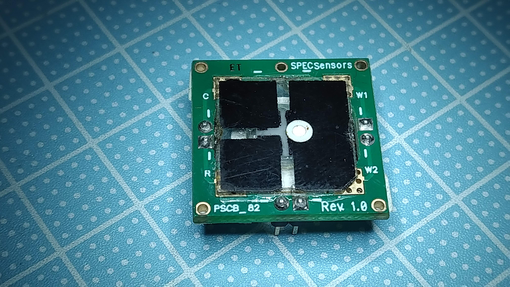

# OZONE12864

ESP32 ozone meater with LCD JLX12864G-332-BN

# sensor

SPEC electrochemical 3SP_O3_20 DIP 

# principle

Potentiostat method. see:
https://qiita.com/nanbuwks/items/b0f3cb8982ab1c29c718